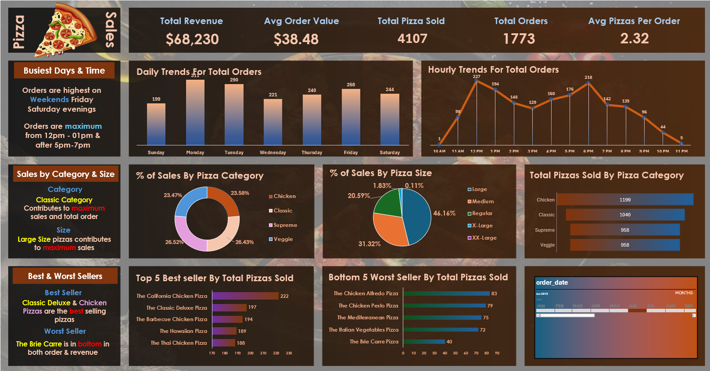

# Pizza-Sales-Analysis-Dashboard


## Project Description

This project is a **Pizza Sales Analysis Dashboard** designed to provide key insights into business performance using real world sales data. The goal was to analyze order trends, identify top selling items, and extract actionable insights that can help improve strategic decision making in a restaurant or food chain environment.

The project is built using:
- **Microsoft SQL Server** – for querying, analyzing, and transforming data.
- **Microsoft Excel** – for creating an interactive and visually engaging dashboard.

## About the Project

In this project, I worked with a dataset containing detailed pizza sales records, including order timestamps, pizza categories, sizes, and prices. I performed SQL based data analysis and imported the results into Excel to create a meaningful dashboard.

## Key Performance Indicators (KPIs)

1. **Total Revenue** – The sum of the total price of all pizza orders  
2. **Average Order Value** – Total revenue divided by the number of orders  
3. **Total Pizzas Sold** – The sum of the quantities of all pizzas sold  
4. **Total Orders** – Total number of individual orders placed  
5. **Average Pizzas Per Order** – Total pizzas sold divided by the number of orders

## SQL Queries For Key Performance Indicators:

### 1. Total Revenue
```sql
TOTAL REVENUE : 
SELECT SUM(total_price) AS TOTAL_REVENUE
from pizza_sales;
```
### 2. Average Order Value
```sql
SELECT sum(total_price)/COUNT(DISTINCT order_id)
AS AVG_ORDER_VALUE FROM pizza_sales;
```

### 3. Total Pizzas Sold
```sql
SELECT sum(quantity) AS total_pizza_sold
FROM pizza_sales
```

### 4. Total Orders
```sql
SELECT COUNT(DISTINCT order_id) AS TOTAL_ORDERS
FROM pizza_sales;
```

### 5. Average Pizzas Per Order
```sql
SELECT CAST(CAST(sum(quantity) AS DECIMAL(10,2)) / cast(count(Distinct order_id)as decimal(10,2))
AS DECIMAL(10,2)) AS AVG_PIZZA_PER_ORDER
from pizza_sales
```

